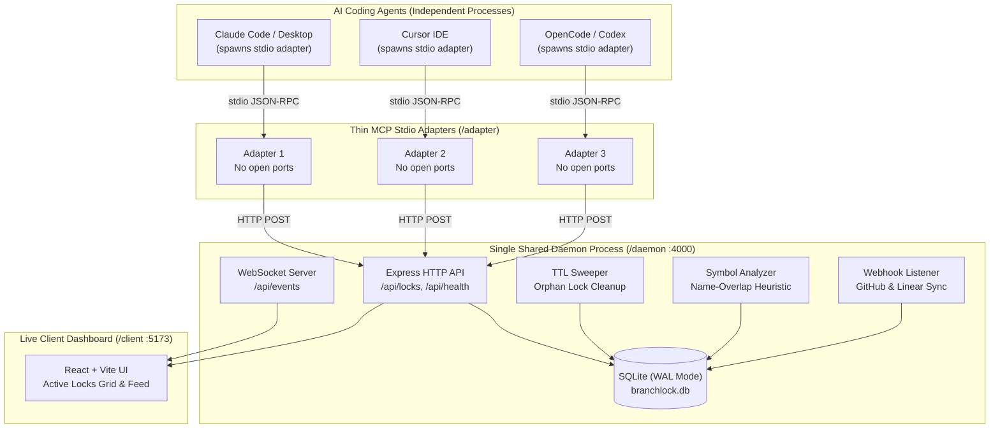

# BranchLock MCP

Multi-Agent Workspace Lock and Semantic Collision Detector

BranchLock MCP prevents AI coding assistants (Claude Code, Cursor, Codex, OpenCode, Windsurf) from causing merge collisions and conflicting overwrites when working concurrently on the same repository.


## Live Demonstration

https://github.com/jamiejustcodes/branchlock-mcp/raw/master/video/demo.mp4

Live demonstration of workspace files being locked in real-time so that only authorized agents (such as Cursor) can modify them, preventing overlapping code edits and merge collisions.


## The Problem

When multiple AI coding assistants work on a shared codebase simultaneously, they have zero awareness of each other's edits. One agent might refactor an authentication module while another rewrites the session handler, leading to:
* Overwritten changes and lost progress
* Git merge conflicts on save or commit
* Broken interfaces due to concurrent modifications
* Duplicate work on the same subsystem


## Architecture and Daemon / Adapter Split

Standard MCP stdio servers run as independent child processes for each connected AI client. If two agents (such as Claude Code and Cursor) both spawn MCP servers that attempt to bind an HTTP or WebSocket port, the second agent crashes with `EADDRINUSE`, breaking multi-agent coordination.

BranchLock resolves this with a two-tier architecture:



### Core Components

1. **/daemon** — A single persistent background Node.js process:
   * Manages the SQLite database (`branchlock.db`) with `PRAGMA journal_mode = WAL;`
   * Atomically resolves multi-file locks with `UNIQUE` partial indexes
   * Houses the WebSocket broadcaster for live status updates
   * Executes background TTL sweep intervals to clean up crashed or orphaned sessions
   * Performs lightweight symbol extraction for cross-file dependency warnings
   * Listens for GitHub and Linear webhooks

2. **/adapter** — A zero-port MCP stdio server:
   * Spawns per connecting AI agent
   * Proxies tool calls as HTTP requests to `http://localhost:4000`
   * Routes internal logging strictly to `stderr` to preserve stdio JSON-RPC protocol integrity
   * Includes auto-start on connect: if the daemon is not running when an agent starts, the first adapter boots it in the background

3. **/client** — Vite, React 19, and Tailwind CSS dashboard:
   * Live Agent Workspace Grid with active countdown timers
   * Real-time event and collision feed over WebSocket
   * Interactive simulation panel to test multi-agent lock scenarios


## Autonomous Workflow (.cursorrules and AGENTS.md)

In day-to-day development, you never need to manually lock or release files. The process is fully automated.

When `.cursorrules` or `AGENTS.md` is present in your repository root, AI agents automatically follow this protocol:

1. You give a normal request (for example, "Refactor the session logic in auth.ts").
2. The agent reads the repository instructions and autonomously calls `claim_files(["src/auth.ts"])` before making any modifications.
3. If the file is free, the lock is granted for 15 minutes and automatically extended in the background via heartbeats.
4. If another agent or developer currently holds the lock, the claim is rejected. The agent halts and notifies you of the conflict with details on who holds the lock and their task summary.
5. When the agent completes the edits, it calls `release_files(["src/auth.ts"])` automatically.


## Connecting AI Assistants

### 1. Installation

Clone and build the monorepo:

```bash
git clone https://github.com/jamiejustcodes/branchlock-mcp.git
cd branchlock-mcp
npm install
npm run build
```

### 2. Configuration

#### Claude Code (CLI)
Run this command in your terminal:
```bash
claude mcp add branchlock node /path/to/branchlock-mcp/adapter/dist/index.js
```
Or add to your project's `.mcp.json` or global `~/.claude.json`:
```json
{
  "mcpServers": {
    "branchlock": {
      "command": "node",
      "args": ["E:/MCPPROJECT/adapter/dist/index.js"]
    }
  }
}
```

#### Cursor IDE
In Cursor Settings > Features > MCP > Add New MCP Server:
* Name: `branchlock`
* Type: `command`
* Command: `node E:/MCPPROJECT/adapter/dist/index.js`

Or add to `.cursor/mcp.json` in your repository root:
```json
{
  "mcpServers": {
    "branchlock": {
      "command": "node",
      "args": ["E:/MCPPROJECT/adapter/dist/index.js"]
    }
  }
}
```

#### Claude Desktop
Add to `%APPDATA%\Claude\claude_desktop_config.json` (Windows) or `~/Library/Application Support/Claude/claude_desktop_config.json` (macOS):
```json
{
  "mcpServers": {
    "branchlock": {
      "command": "node",
      "args": ["E:/MCPPROJECT/adapter/dist/index.js"]
    }
  }
}
```

#### Codex, OpenCode, Windsurf, Cline, Roo Code
Any client supporting the Model Context Protocol stdio transport connects using:
```json
{
  "mcpServers": {
    "branchlock": {
      "command": "node",
      "args": ["E:/MCPPROJECT/adapter/dist/index.js"]
    }
  }
}
```


## Testing and Simulation

### Interactive Terminal Testing (Jamie vs Dev2)

To manually test collision handling between two simulated sessions:

1. Start the dev server:
   ```bash
   npm run dev
   ```
2. Open the dashboard at `http://localhost:5173`.
3. In Terminal 1 (as Jamie):
   ```bash
   node cli.mjs Jamie
   ```
   Run:
   ```
   claim src/auth.ts "Refactoring user authentication"
   ```
   The dashboard displays an active lock card for Jamie with a 15-minute countdown.

4. In Terminal 2 (as Dev2):
   ```bash
   node cli.mjs Dev2
   ```
   Attempt to claim the same file:
   ```
   claim src/auth.ts "Trying to edit the same file"
   ```
   Terminal 2 reports `COLLISION BLOCKED`, and the dashboard displays a red conflict alert in the live event feed.

5. Handover:
   * In Terminal 1 (Jamie), run `release src/auth.ts`.
   * In Terminal 2 (Dev2), re-run `claim src/auth.ts`. The claim now succeeds cleanly without merge conflicts.

### Automated Test Suite

Run the end-to-end integration test:
```bash
node test-e2e.mjs
```

Or run the timed multi-agent drama arena:
```bash
node live-arena.mjs
```


## MCP Tools Reference

| Tool Name | Parameters | Description |
|---|---|---|
| `claim_files` | `paths: string[]`, `agentId: string`, `taskSummary: string`, `ttlMinutes?: number`, `issueId?: string` | Atomically claims exclusive locks on files. If any file is locked by another active agent, returns conflict details and blocks the claim. |
| `release_files` | `paths: string[]`, `agentId: string`, `completed?: boolean` | Releases locks owned by the requesting agent. Triggers completion comment sync if `completed: true`. |
| `check_file_locks` | `paths?: string[]` | Queries active locks. Returns file paths, owning agents, task summaries, and expiration timestamps. |
| `broadcast_context` | `decisionNotes: string`, `agentId: string` | Shares architectural decisions and status across all connected agents and the live dashboard in real time. |
| `send_heartbeat` | `paths: string[]`, `agentId: string` | Extends TTL on active locks. Also handled automatically in the background by the adapter. |


## Semantic Conflict Heuristics

Phase 2 includes a name-overlap heuristic:

1. When an agent claims a file (for example, `auth.ts`), BranchLock extracts top-level exported functions, classes, and types (such as `validateToken`, `AuthSession`).
2. When a second agent claims another file (`session.ts`), BranchLock inspects imports in `session.ts`.
3. If `session.ts` imports symbols from `auth.ts` while `auth.ts` is actively locked by another agent, BranchLock surfaces a non-blocking warning:
   > "Note: session.ts imports validateToken from auth.ts, currently locked by Claude-Code-01"


## GitHub and Linear Webhook Integration

The BranchLock daemon provides webhook handlers with HMAC SHA-256 signature verification:
* `POST /api/webhooks/github` (verified with `GITHUB_WEBHOOK_SECRET`)
* `POST /api/webhooks/linear` (verified with `LINEAR_WEBHOOK_SECRET`)

To test locally with ngrok:
```bash
npm run dev
ngrok http 4000
```

Configure environment variables in `.env`:
```env
GITHUB_WEBHOOK_SECRET=your_secret_here
GITHUB_TOKEN=ghp_your_token_here
GITHUB_REPO=owner/repo
LINEAR_WEBHOOK_SECRET=your_linear_secret_here
LINEAR_API_KEY=your_linear_api_key
```

When an agent releases locks with `completed: true` linked to an `issueId`, BranchLock posts an automated completion comment summarizing changes.


## Background Services and Deployment

BranchLock automatically boots the daemon on first agent connect. For always-on persistent deployment:

### PM2
```bash
npm install -g pm2
pm2 start daemon/dist/index.js --name branchlock-daemon
pm2 startup
pm2 save
```

### systemd
```ini
[Unit]
Description=BranchLock MCP Daemon
After=network.target

[Service]
Type=simple
ExecStart=/usr/bin/node /path/to/branchlock-mcp/daemon/dist/index.js
Restart=always

[Install]
WantedBy=default.target
```


## License

MIT © [jamiejustcodes](https://github.com/jamiejustcodes)
