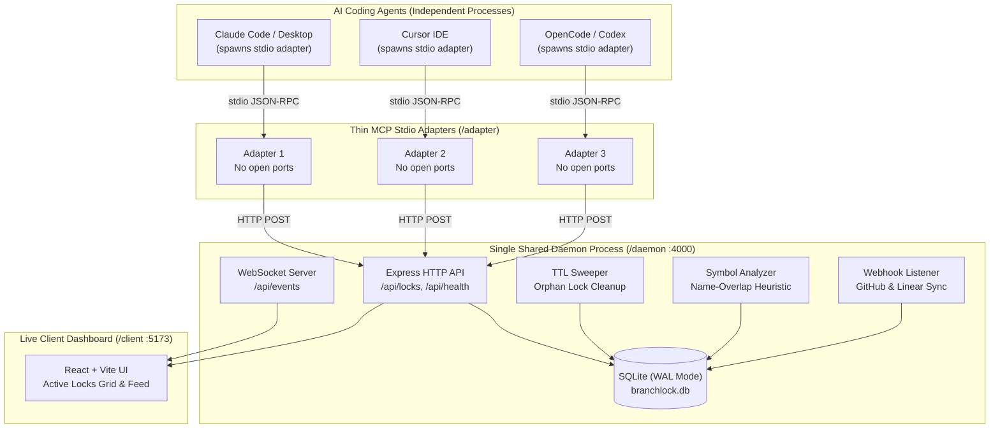

# 🔒 BranchLock MCP

**Multi-Agent Workspace Lock & Semantic Collision Detector**

BranchLock MCP prevents AI coding agents (Claude Code, Cursor, Codex, OpenCode) from causing silent merge collisions and conflicting overwrites when working simultaneously on the same codebase.

---

## 🎯 The Problem

When multiple AI coding assistants work on a shared repository simultaneously, they have zero awareness of each other's actions. One agent might refactor an authentication module while another rewrites the session handler, leading to:
- Overwritten changes and lost progress
- Git merge conflicts on save/commit
- Broken interfaces due to concurrent modifications
- Duplicate work on the same subsystem

---

## 🏗️ Architecture & Daemon / Adapter Split

Standard MCP stdio servers run as independent child processes for each connected AI client. If two agents (e.g. Claude Desktop and Cursor) both spawn MCP servers that try to bind an HTTP/WebSocket port, the second agent crashes with `EADDRINUSE`, breaking multi-agent coordination.

BranchLock solves this with a two-tier architecture:



### Key Components

1. **/daemon** — A single persistent background Node.js process:
   - Manages SQLite database (`branchlock.db`) with `PRAGMA journal_mode = WAL;`
   - Atomically resolves multi-file locks with `UNIQUE` partial indexes
   - Houses the WebSocket broadcaster for live status updates
   - Executes background TTL sweep intervals to clean up crashed or orphaned sessions
   - Performs lightweight symbol extraction for cross-file dependency warnings
   - Listens for GitHub / Linear webhooks

2. **/adapter** — A zero-port MCP stdio server:
   - Spawns per connecting AI agent
   - Proxies tool calls as HTTP requests to `http://localhost:4000`
   - Routes internal logging strictly to `stderr` to preserve stdio JSON-RPC protocol integrity
   - Includes **auto-start-on-connect**: if the daemon isn't running when an agent starts, the first adapter silently boots it in the background

3. **/client** — Vite + React 19 + Tailwind CSS dashboard:
   - Live Agent Workspace Grid with active countdown timers
   - Real-time event and collision feed over WebSocket
   - Interactive simulation panel to test multi-agent lock scenarios

---

## 🚀 Quick Start

### 1. Installation

Clone and build the monorepo:

```bash
git clone https://github.com/jamiejustcodes/branchlock-mcp.git
cd branchlock-mcp
npm install
npm run build
```

### 2. Configure Your AI Agents

#### Claude Desktop (`claude_desktop_config.json`)

Add BranchLock to `%APPDATA%\Claude\claude_desktop_config.json` (Windows) or `~/Library/Application Support/Claude/claude_desktop_config.json` (macOS):

```json
{
  "mcpServers": {
    "branchlock": {
      "command": "node",
      "args": ["E:/MCPPROJECT/adapter/dist/index.js"]
    }
  }
}
```

#### Cursor (`.cursor/mcp.json` or Cursor Settings)

```json
{
  "mcpServers": {
    "branchlock": {
      "command": "node",
      "args": ["E:/MCPPROJECT/adapter/dist/index.js"]
    }
  }
}
```

### 3. Running the Dashboard (Optional / Dev)

Start the local development stack:

```bash
npm run dev
```

- **Daemon API & WS**: `http://localhost:4000`
- **Live Dashboard**: `http://localhost:5173`

---

## 🛠️ MCP Tools Reference

| Tool Name | Parameters | Description |
|---|---|---|
| `claim_files` | `paths: string[]`, `agentId: string`, `taskSummary: string`, `ttlMinutes?: number`, `issueId?: string` | Atomically claims exclusive locks on files. If any file is locked by another active agent, returns conflict details and blocks the claim. |
| `release_files` | `paths: string[]`, `agentId: string`, `completed?: boolean` | Releases locks owned by the requesting agent. Triggers completion comment sync if `completed: true`. |
| `check_file_locks` | `paths?: string[]` | Queries active locks. Returns file paths, owning agents, task summaries, and expiration timestamps. |
| `broadcast_context` | `decisionNotes: string`, `agentId: string` | Shares architectural decisions and status across all connected agents and the live dashboard in real time. |
| `send_heartbeat` | `paths: string[]`, `agentId: string` | Extends TTL on active locks. (Also handled automatically in background by the adapter). |

---

## 🔍 Semantic Conflict Heuristic (Phase 2)

> [!NOTE]
> **Scope & Framing**: Phase 2 implements a lightweight, high-performance **name-overlap heuristic**, not a full cross-file semantic type checker or language server.

### How It Works:
1. When an agent claims a file (e.g. `auth.ts`), BranchLock extracts its top-level exported functions, classes, and types (e.g. `validateToken`, `AuthSession`).
2. When a second agent claims another file (e.g. `session.ts`), BranchLock inspects `session.ts`'s imports.
3. If `session.ts` references symbols exported from `auth.ts` while `auth.ts` is actively locked by Agent 1, BranchLock surfaces a **soft warning** (non-blocking) on the dashboard and in the check response:
   > *"Note: session.ts imports 'validateToken' from auth.ts, currently locked by Claude-Code-01"*

---

## 🔄 GitHub & Linear Webhook Sync (Phase 3)

BranchLock daemon includes built-in webhook handlers with HMAC SHA-256 signature verification.

### Supported Endpoints:
- `POST /api/webhooks/github` (verified against `GITHUB_WEBHOOK_SECRET`)
- `POST /api/webhooks/linear` (verified against `LINEAR_WEBHOOK_SECRET`)

### Setup with Local Tunnel (ngrok)

To test webhooks locally:

```bash
# Start your local daemon
npm run dev

# In another terminal, open an ngrok tunnel
ngrok http 4000
```

Set your webhook URL in GitHub/Linear to `https://<your-ngrok-subdomain>.ngrok.io/api/webhooks/github` and configure your secret in `.env`:

```env
GITHUB_WEBHOOK_SECRET=your_secret_here
GITHUB_TOKEN=ghp_your_token_here
GITHUB_REPO=owner/repo
LINEAR_WEBHOOK_SECRET=your_linear_secret_here
LINEAR_API_KEY=your_linear_api_key
```

When an agent releases files with `completed: true` linked to an `issueId`, BranchLock posts an automated completion comment summarizing the changes.

---

## ⚡ Daemon Lifecycle & Background Services

By default, BranchLock uses **zero-config auto-boot**: the first connecting agent starts the daemon as a detached process if not already active.

For continuous, always-on setups without depending on agent connections:

### PM2 (Recommended)
```bash
npm install -g pm2
pm2 start daemon/dist/index.js --name branchlock-daemon
pm2 startup
pm2 save
```

### systemd (Linux User Service)
```ini
# ~/.config/systemd/user/branchlock.service
[Unit]
Description=BranchLock MCP Daemon
After=network.target

[Service]
Type=simple
ExecStart=/usr/bin/node /path/to/branchlock-mcp/daemon/dist/index.js
Restart=always

[Install]
WantedBy=default.target
```

---

## 🛡️ License

MIT © [jamiejustcodes](https://github.com/jamiejustcodes)
